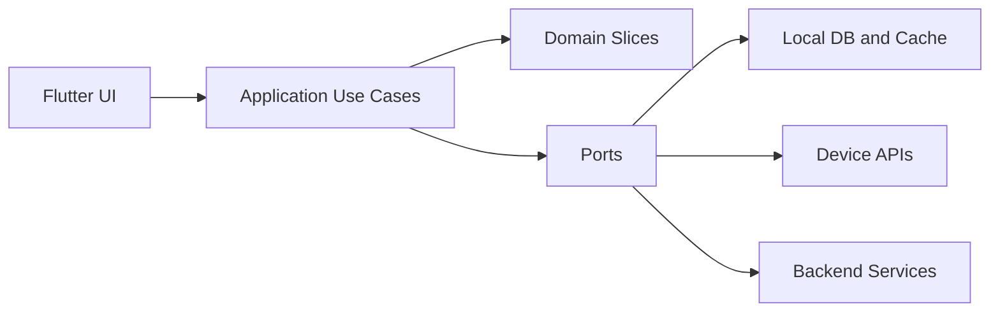
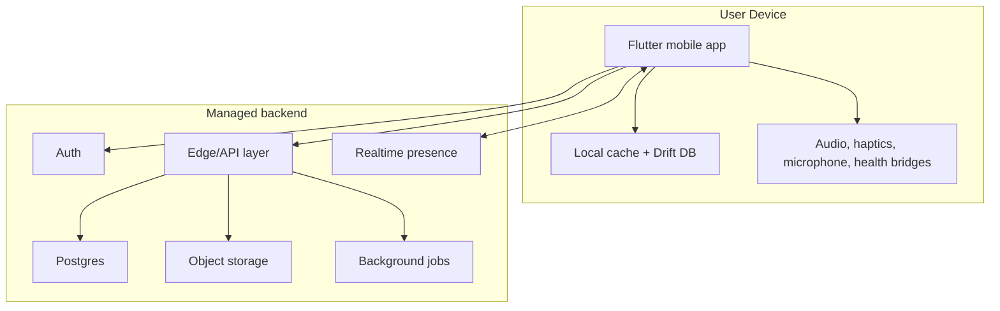
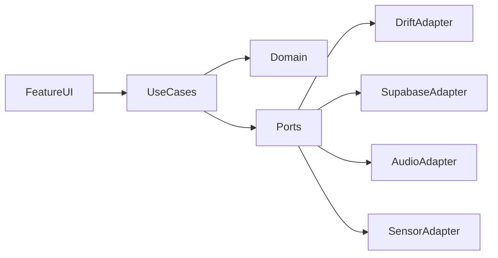

# Architecture Spine — meditation-community

## Design Paradigm

`meditation-community` dùng `modular hexagonal architecture` với hai khối chính:

- `apps/mobile`: Flutter app offline-first, chứa domain, application use cases, local persistence, và adapter tới audio, haptics, microphone, health signals.
- `services/core`: backend mỏng cho auth, content catalog sync, presence, reflection enrichment, storage, và policy enforcement.

Mỗi capability sống trong một domain slice ổn định:

- `session_runtime`
- `content_catalog`
- `continuity`
- `sensing`
- `reflection`
- `community_presence`



## Invariants & Rules

### AD-1 — Domain slices own aggregates and mutations

- **Binds:** all
- **Prevents:** Logic cùng ghi đè vào session, ritual, content progress, hoặc presence từ nhiều chỗ khác nhau.
- **Rule:** Mỗi aggregate chỉ có một slice sở hữu và chỉ bị mutate qua use case của slice đó. Slice khác chỉ truy cập qua query contract hoặc domain event, không chạm storage/schema của nhau trực tiếp.

### AD-2 — Session timeline is the system of record

- **Binds:** CAP-1, CAP-2, CAP-3, CAP-5
- **Prevents:** Growth map, reflection, analytics, và recovery state lệch nhau vì mỗi màn hình cập nhật summary riêng.
- **Rule:** Bắt đầu, pause, complete, abort, SOS, timer bell, gentle re-entry, check-in, voice journal attach, và ritual replay đều được ghi thành immutable session timeline events. Mọi summary/read model được derive từ timeline này.

### AD-3 — Mobile remains useful offline and without sensors

- **Binds:** CAP-1, CAP-2, CAP-3, CAP-7
- **Prevents:** Giá trị cốt lõi phụ thuộc mạng, wearable, hoặc health permission.
- **Rule:** Home, content discovery cho core packs, playback, timer, growth map, check-in, ritual replay, và post-session reflection cơ bản phải chạy được từ local state. Backend sync và sensor enrichment chỉ làm giàu, không là điều kiện để core flow thành công.

### AD-4 — Sensing flows through permission-gated normalization adapters

- **Binds:** CAP-4, CAP-5
- **Prevents:** Feature code phụ thuộc trực tiếp platform API, lưu raw signal bừa bãi, hoặc tạo behavior khác nhau không kiểm soát giữa iOS và Android.
- **Rule:** Microphone noise sampling, HealthKit, và Health Connect chỉ được gọi qua `sensing` adapters trả về normalized evidence (`noise_level`, `sampling_confidence`, `heart_rate_window`, `hrv_window`, `motion_state`). Không upload raw microphone audio. Core flow không được fail khi adapter không khả dụng hoặc quyền bị từ chối.

### AD-5 — Reflection is narrative trend, never a score

- **Binds:** CAP-3, CAP-5
- **Prevents:** App trượt thành health dashboard hoặc gamified meditation score.
- **Rule:** `reflection` chỉ xuất bản trend/narrative read models từ session timeline, self check-in, noise context, và sensor evidence được phép dùng. Không có leaderboard, percentile, rank, hay “meditation score” tuyệt đối trong bất kỳ API hoặc schema nào.

### AD-6 — Community is ephemeral aggregate presence only

- **Binds:** CAP-6
- **Prevents:** Quiet presence biến thành social graph, feed, hoặc chat platform.
- **Rule:** Presence chỉ tồn tại dưới dạng aggregate bucket/time block và session-local membership ngắn hạn. Nudge là preset hữu hạn. Không có free-form chat, follower graph, public profile bắt buộc, hay lưu trữ quan hệ “ai thiền cùng ai” như dữ liệu sản phẩm dài hạn.

### AD-7 — Backend is a managed product backend, not a custom microservice mesh

- **Binds:** all
- **Prevents:** Overbuild hạ tầng sớm, đội triển khai phải tự gánh auth/realtime/storage quá sớm, hoặc domain logic rải ra nhiều service nhỏ khó giữ nhất quán.
- **Rule:** V1 dùng một backend lõi managed quanh Postgres/Auth/Object Storage/Realtime và chỉ thêm edge/background jobs cho các tác vụ bất đồng bộ như content sync, reflection enrichment, presence cleanup, và notification orchestration. Tránh tách microservices trước khi có áp lực scale hoặc organizational boundary thật.

## Consistency Conventions

| Concern | Convention |
| --- | --- |
| Naming (entities, files, interfaces, events) | Domain entities dùng singular noun (`Session`, `Ritual`, `PresenceBucket`); use case theo động từ (`StartSession`, `CompleteSession`); event theo past tense (`session_completed`). |
| Data & formats (ids, dates, error shapes, envelopes) | ID là UUIDv7 string; thời gian lưu UTC ISO-8601; local UI tự render timezone; error envelope thống nhất `code`, `message`, `retryable`, `details`. |
| State & cross-cutting (mutation, errors, logging, config, auth) | Mutation đi qua use case command; query models read-only; feature flags và permission state được inject qua config/providers; mọi sync conflict ưu tiên timeline append rồi mới reconcile summary. |
| Privacy & retention | Voice journal audio là private user content; noise chỉ lưu classification và confidence; health data chỉ lưu normalized windows hoặc derived reflection inputs đã được phép dùng. |

## Stack

| Name | Version |
| --- | --- |
| Flutter | 3.41.0 |
| Dart | 3.10.x |
| flutter_riverpod | 3.3.2 |
| go_router | 17.3.0 |
| supabase_flutter | 2.14.0 |
| drift | 2.34.0 |
| just_audio | 0.10.5 |
| health | 13.3.1 |

## Structural Seed

### System topology



### Dependency direction



### Source tree seed

```text
apps/
  mobile/
    lib/
      app/                # routing, shell, dependency setup
      core/               # shared kernel, error, ids, clocks, feature flags
      features/
        session_runtime/
        content_catalog/
        continuity/
        sensing/
        reflection/
        community_presence/
      adapters/
        local/
        backend/
        device/
services/
  core/
    db/                   # schema, policies, migrations
    functions/            # edge/background jobs
content/
  seed/                   # curated packs, labels, manifests
```

### Operational envelope

- `dev`: local emulator/simulator + managed cloud dev project.
- `staging`: shared internal project dùng test accounts, seeded content, và synthetic presence traffic.
- `prod`: iOS-first launch environment; Android joins with cùng backend contracts nhưng có thể khác capability flags cho sensing/health.
- Content media nằm ở object storage với manifest versioning; curated metadata sync xuống mobile cache theo bundle/version.

## Capability → Architecture Map

| Capability / Area | Lives in | Governed by |
| --- | --- | --- |
| CAP-1 Calm entry and low-friction selection | `apps/mobile/features/session_runtime`, `content_catalog`, `continuity` | AD-1, AD-3 |
| CAP-2 Session execution, timer, SOS, re-entry | `apps/mobile/features/session_runtime`, device adapters | AD-2, AD-3 |
| CAP-3 Growth map, journal, ritual, continuity | `continuity`, `reflection`, local cache, storage | AD-1, AD-2, AD-5 |
| CAP-4 Noise-aware guidance | `sensing`, `content_catalog`, device adapters | AD-4 |
| CAP-5 Biofeedback reflection | `sensing`, `reflection`, backend enrichment jobs | AD-2, AD-4, AD-5 |
| CAP-6 Quiet community presence | `community_presence`, realtime backend | AD-6, AD-7 |
| CAP-7 Seeded content ecosystem and offline core | `content_catalog`, local cache, storage | AD-3, AD-7 |

## Deferred

- Monetization boundary giữa core và premium differentiators được defer sang product/spec layer; kiến trúc hiện chỉ yêu cầu capability flags và entitlement seam, chưa khóa billing provider.
- Notification orchestration, lock-screen/widget entry, và watch companion được defer tới khi có story riêng; chỉ cần giữ adapter seam ở `device`.
- AI-tailored sessions và journal distillation được defer; nếu xuất hiện sau này, chúng phải tiêu thụ cùng session timeline và privacy conventions hiện có, không tạo data path song song.
